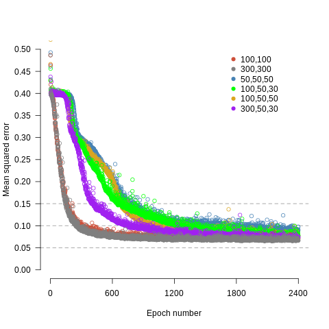
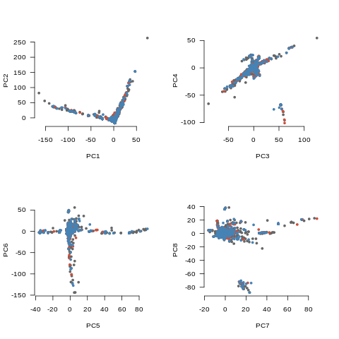

# Kaggle Competition - Personalized Medicine: Redefining Cancer Treatment

## Summary

### Filtering (see B_getfeat/Makefile for details)

- upper -> lower
- collapse "pvalue = " & "pvalue < " variations into "pvalueequal" & "pvalueless"
- remove punctuation and collapse whitespace to single space
- remove words that contain letters that are not a-z
- remove words that contain only a, t, g, c, or u
- keep only words with length > 3 && < 20
- order adjacent words alphabetically and concatenate separated by dash
  ("significant result" -> "result-significant") to create word bigrams
- keep only pairs of words that occur > 175 times in total accross all manuscripts

### Obtain features (see B_getfeat/Makefile for details)

- count number of occurances of each bigram in each training example (manuscript)
- shuffle training set and split into training (80%) and test (20%) datasets,
  then split training once again into training (80%) and cross-validation (20%).
  This gives three datasets called "mytrain", "mycvs" and "mytest" with 2952, 590
  and 737 examples in each
- calculate the mean and standard deviation of "mytrain"
- filter out features in mytrain, mycvs and mytest where the standard deviation
  is zero
- normalise mytrain, mycvs and mytest using the mean and standard deviation of
  mytrain
- perform PCA on mytrain and use this to project mycvs and mytest onto the mytrain
  vector space to get the features for each dataset

### Training (see C_train/Makefile for details)

- neural networks using mini-batch stochastic gradient descent and L2 normalisation

